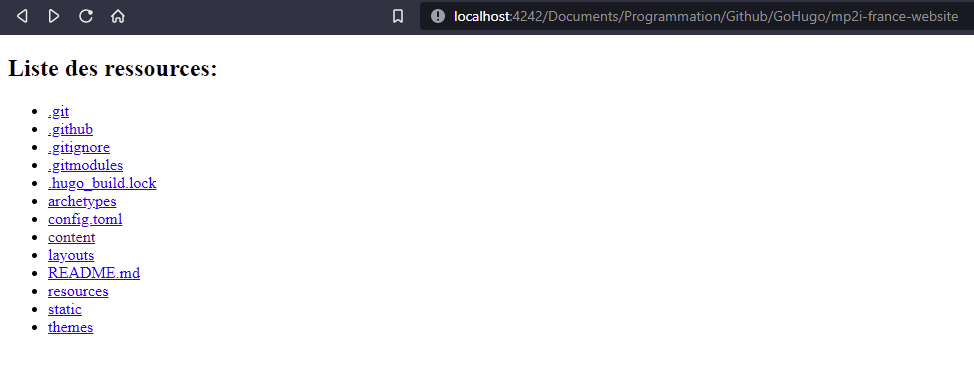

# Nebula Server Directories

This site can be used to list folder and subdirectories in your server :



## Python

It's required to have Python 3.8 or more  installed on your system.
[Download Python](https://www.python.org/downloads/)

## Installation using Pipenv

Install `pipenv` dependencies:

```sh
python3 -m pip install pipenv
```

Now, you can create an empty `.venv` directory and running `pipenv`.
It will install packages in the virtual environment (recommended).

```sh
pipenv install
```

## Configuration

You have to write the configuration in the **config.toml** file,
here is an example:

```toml
url = "http://localhost:4242/"

[user]
    name = "Adrien"

[folders]
    [folders.Documents]
        path = "/home/adrien/Documents"

    [folders.Images]
        path = "/home/adrien/Images"
```

The `folders` option are used to show the root points for the listing of directories.

## Deployment

You can specify the host and the port for the flask server:

```sh
flask run -h localhost -p 4242
```

Now you can see your site at <http://localhost:4242/>
